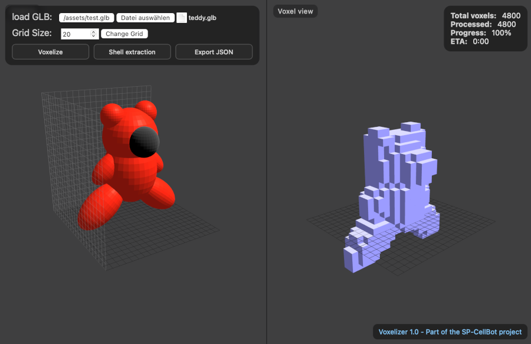

# Voxelizer
Voxelizer 1.0 - Part of the [SP-CellBot](https://github.com/svenpohl/sp-cellbots) project



**Voxelizer** is a **Three.js**-based tool for voxelizing 3D objects in **GLB format**.  
It is designed as a preprocessing step for generating 3D target structures for the [SP-CellBots](https://github.com/svenpohl/sp-cellbots) project.  
The tool converts a loaded 3D model into a connected voxel structure that can later be loaded into the CellBots simulation and “morphed” by simulated bots.

---

## Changelog
### [1.0] - 2025-08-11

Initial release: GLB import, grid size, shell extraction, progress, JSON export.

 
---

## ✨ Features

- **GLB file import** (only `.glb` format)
- **Configurable voxel grid size** (default: `10×10×10`)
- **Inside/outside detection** using raycasting in 6 axis directions
- **Optional Shell Extraction**:
  - Removes all inner voxels
  - Keeps only the outer shell  
  - Ensures each voxel has at least one orthogonal neighbor
- **Progress display** with percentage and estimated remaining time (ETA)
- **Dual view**:
  - **Left:** Original model (zoom and rotate with mouse)
  - **Right:** Voxelized model
- **JSON export** in simple coordinate form:
  ```json
  [
    { "x": 0, "y": 2, "z": 2 },
    { "x": 0, "y": 3, "z": 2 },
    { "x": 0, "y": 3, "z": 3 },
    { "x": 1, "y": 1, "z": 1 }
  ]
  ```

---

## 📦 Installation

1. Clone the repository:
   ```bash
   git clone https://github.com/yourusername/voxelizer.git
   cd voxelizer
   ```

2. Install dependencies:
   ```bash
   npm install
   ```

---

## 🚀 Usage

Start the local server:
```bash
node voxelizer.js
```

Open the frontend in your browser:
```
http://localhost:5174
```

**Workflow:**
1. Load a `.glb` file (e.g., from `assets/teddy.glb` or `assets/test.glb`).
2. Adjust grid size if needed.
3. (Optional) Enable **Shell Extraction** to keep only the outer shell voxels.
4. Start voxelization — progress will be displayed.
5. Download the generated `.json` file containing voxel coordinates.

---

## 🖼 Example

- **Left panel:** Original 3D model  
- **Right panel:** Voxelized model  
- Progress bar shows voxelization percentage.

---

## 📄 License

This project is licensed under the [MIT License](LICENSE).
